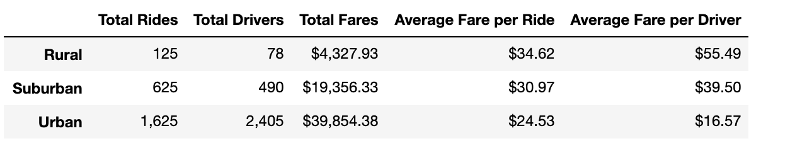

# PyBer_Analysis
  In this assignment, I wanted to synthesize the key metrics for the ride-sharing data by creating a summary DataFrame. Furthermore, I created a line graph that would visiually demonstrate the disparities between city types and provide data to support my recommendations that I would give the CEO. I cleaned and analyzed the data by using key concepts I used in this module such as creating DataFrames and utilizing the groupby() function. According to the line chart and summary DataFrame, 
    rural cities have the least amount of drivers and total rides. This makes the average cost per ride and average fare per driver much higher than the average costs in suburban or urban cities. However, urban cities have more drivers and total rides which make the average cost per ride much cheaper. The summary DataFrame shows us that the data is reasonable and makes sense: the lower the population density in the city, the less rides given and higher price per ride. 
  The main challenge I ran into was formatting the 

The third paragraph should include the following:

Based on the data from the different city types, what recommendations would you give the CEO for addressing any disparities among the city types?
Provide two additional analyses you could do to gain more insight into the data, like using other datasets.
What technical steps would you take to perform the additional analyses?
